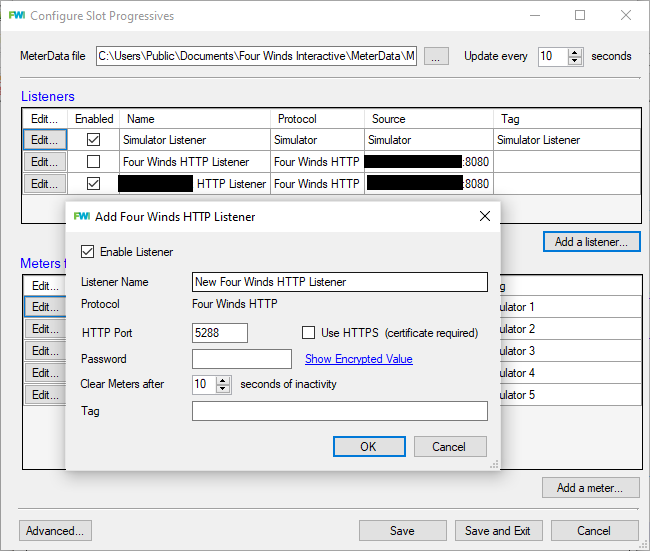
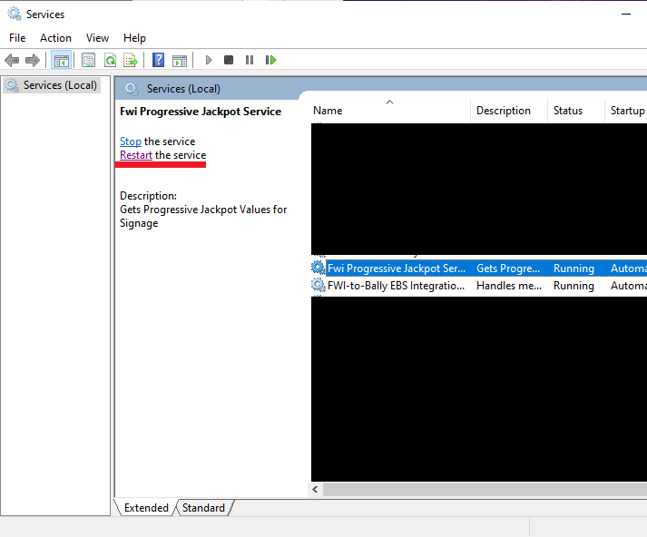
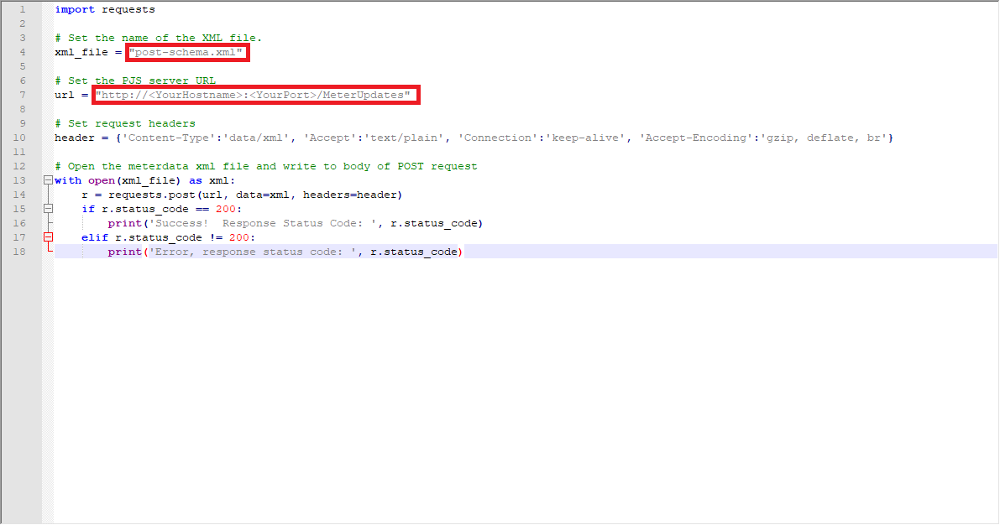

# FWI HTTP Post Script

Intended for use with Four Winds Interactive's proprietary Progressive Jackpot Service software.

## About

This is a very basic python script intended to take a progressive xml file and merge it with the PJS MeterData.xml via the Four Winds HTTP Listener.  The Python script writes the local xml to the PJS machine via HTTP Post request.

It is assumed that the client is updating this progressive xml through their own means (presumably their own progressive integration).  It is also assumed the client’s local xml **exactly matches** the schema required, see [post-schema.xml](required-files/post-schema.xml).  

The purpose of this script is simply to merge the local xml with the PJS MeterData.xml so it can be distributed to the signage PCs through socket request/multicast IP.

## Machine Setup

1.  If you haven't already, install and configure FWI Progressive Jackpot Service on your designated machine/server.

2.	On the designated machine (the same PC with the progressive xml file), download the latest version of [Pyhton for Windows](https://www.python.org/downloads/windows/)

3.  Also install [Pip for Windows](https://pip.pypa.io/en/stable/installing/)

4.  Fetch the `progressivepost.py` script and copy it into the exact same UNC folder path as your progressive xml. 

## PJS Setup

1.  Inside FWI Progressive Jackpot Viewer go to Edit -> Configure Slot Progressives then click Add a Listener -> Four Winds HTTP.

2.  Add the meters to match your progressive xml.  **Importantly** the Meter `Group` and `Level` must **exactly match** as it's labeled in your progressive xml.

3.  Once all of your meters have been addded save your changes, ensure your listener is enabled, and restart the FWi Progressive Jackpot Service

## Configure the python script

Inside the [progessivespost.py](required-files/progressivespost.py) file, update the `xml_file` and `url` variables.  The `xml_file` field should exactly match the filename of your progressive xml.  For the `url` you'll just need to update the `Hostname` and `port` fields with your PJS server's hostname and the port you're using, respectively.  If you're instead looking to post Jackpot Hits information, change the file path from `/MeterUpdates` to `/JackpotHit`.

It's important to note, this documentation assumes your progressive xml and this python script are in the same folder, on the same machine as your PJS client.  If your PJS client is on a different server, you'll need to make sure that server is network accessible and can accept incoming requests over your designated port.

### Quick Test

Once your python script has been updated, let's run a quick test to make sure everything is working.  Open up a terminal view and path to your python script/progressive xml folder `cd <yourfilepath>`.  